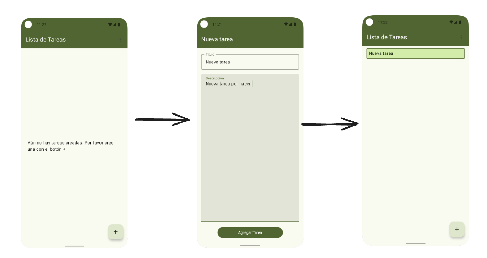
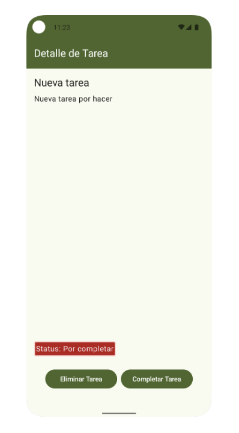
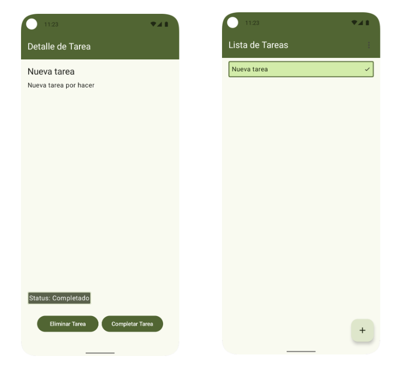
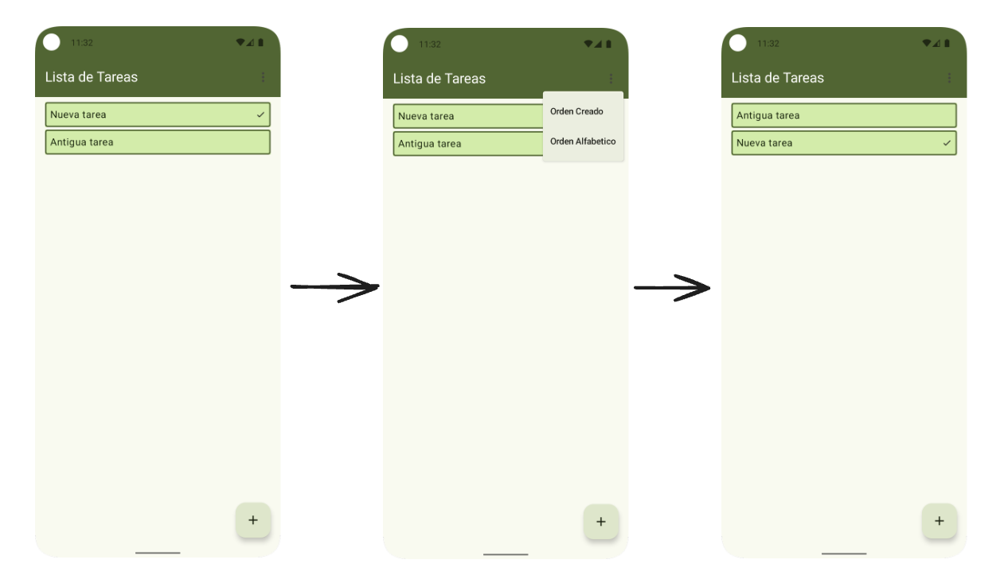
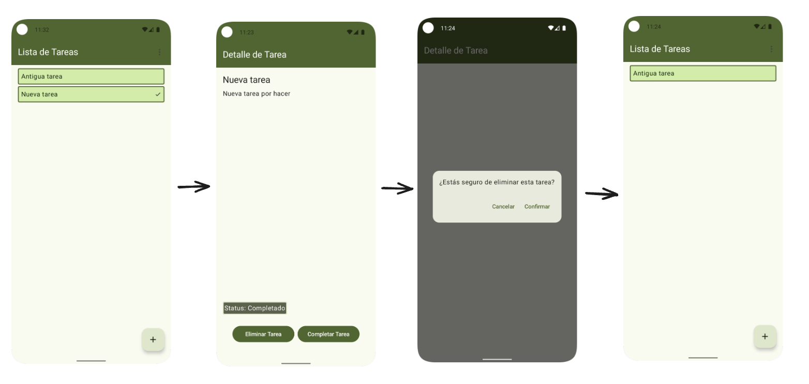
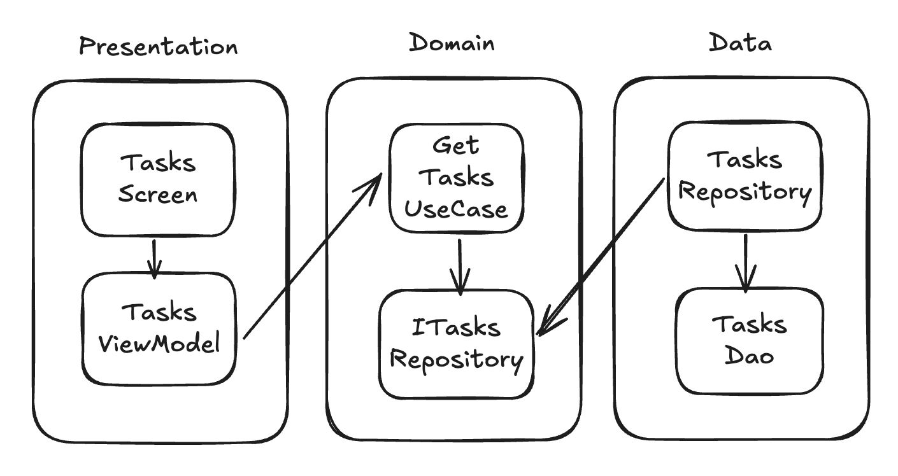

# BletaTodo

## Acerca del proyecto

Se ha hecho una aplicación para gestionar tareas. Las tareas pueden cambiar de estado de por completadas a completar. Se utiliza una base de datos local para almacenar las tareas. Las principales funcionalidades son

- **Agregar una tarea**: Al hacer click en el botón + te lleva a otra pantalla donde se puede agregar los datos de la nueva tarea a crear. La tarea se crea por defecto en estado *Por completar*

- **Ver detalle de tarea**: Al hacer click en alguna tarea de la lista, se va a otra pantalla donde se ve los detalles de esta.

- **Completar Tarea**: Al hacer click en el botón completar tarea se cambia el estado de la tarea tanto en la pantalla del detalle como en la lista de tareas.

- **Ordenar Tareas**: Al dar click en el icono de más opciones sale en menú para escoger el orden en el que mostrar la lista de tareas. Hay dos opciones alfabético y en orden de creación.

- **Eliminar Tarea**: En la pantalla de detalle de tarea hay una opción para elminiar la tarea. Se muestra un mensaje de confirmación antes de efectuar la acción

## Arquitectura

Se ha divido el proyecto en 3 capas mediante paquetes:

- Presentation: En este capa se encuentra la interfaz de usuario mediante Composables y se utiliza los ViewModel como contendores de estado
- Domain: En esta capa se encuentran los casos de uso que abstraen la lógica de negocio y las interfaces de los repositorios.
- Data: En esta capa se encuentran los repositorios . En el caso de este proyecto solo se está utilizando como dataSource de una base de datos local.

La finalidad de esta división es que tanto la capa Presentation como Data dependan solamente de Domain y asi tenerlas desacopladas entre si.

Por ejemplo, para la funcionalidad de mostrar las tareas las dependencias serían de esta forma:

## Librerías utilizadas

- [Dagger Hilt](https://developer.android.com/training/dependency-injection/hilt-android): Para hacer inyección de dependencias
- [Navigation](https://developer.android.com/develop/ui/compose/navigation): Para manejar la navegación entre las pantallas
- [Room](https://developer.android.com/training/data-storage/room): Para manejar la interacción con la base de datos
- [MockK](https://mockk.io/): Para crear mocks en las pruebas unitarias y pruebas instrumentadas

## Mejoras a futuro

- Agregar pruebas de integracion entre panatallas
- Agregar un DataSource que interactúe con un servidor
